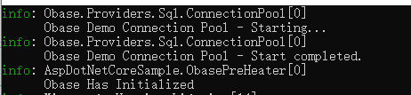
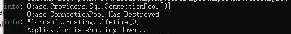

## dotNet

### Obase连接池配置

Obase使用IObaseConnectionPoolConfiguration接口规定连接池的相关配置,只要实现此接口并注入至Obase的依赖注入框架即可对连接池进行配置.

在ASP.NET CORE框架下,我们可以使用ASP.NET CORE提供的配置文件注入功能来实现从配置文件中读取相关配置的功能.

首先实现IObaseConnectionPoolConfiguration接口,并在构造函数里注入IConfiguration读取配置文件:


```
/// <summary>
///     Obase连接池配置
/// </summary>
public class ObaseConnectionPoolConfiguration : IObaseConnectionPoolConfiguration
{
    /// <summary>
    ///     配置文件
    /// </summary>
    private readonly IConfiguration _configuration;

    /// <summary>
    ///     初始化Obase连接池配置
    /// </summary>
    /// <param name="configuration">配置文件</param>
    public ObaseConnectionPoolConfiguration(IConfiguration configuration)
    {
        _configuration = configuration;
    }

    /// <summary>
    ///     名称
    /// </summary>
    public string Name => _configuration.GetSection("ObaseConnectionPool")["Name"];

    /// <summary>
    ///     最大连接池大小
    /// </summary>
    public int MaximumPoolSize => Convert.ToInt32(_configuration.GetSection("ObaseConnectionPool")["MaxPoolSize"]);
}
```

此处的配置即为配置文件里对应的值.

在启动文件里注册到ASP.NET CORE的服务之后,ASP.NET COREt就会把这个类作为服务保存在自己的依赖注入容器里,接下来只要从ASP.NET CORE的容器中取出此配置类并注册至Obase的依赖注入中即可.

**这里需要注意的是,Obase的连接池的配置只有在连接池构造时才会生效,所以这里要分为两种情况进行讨论,分别是不使用预热器和使用预热器的情况:**

- 不使用预热器:

不使用预热器时,Obase连接池是在首次查询时才进行构造,那么就可以在主启动类里注册至Obase的依赖注入框架.

示例代码如下:


```
var builder = WebApplication.CreateBuilder(args);
builder.Services.AddControllers();
 //注入Obase
builder.Services.AddTransient<ContextConfiguration>();
builder.Services.AddTransient<SampleObjectContext>();
//此处注入配置到ASP.NET CORE的服务里
builder.Services.AddSingleton<IObaseConnectionPoolConfiguration, ObaseConnectionPoolConfiguration>();
var app = builder.Build();
//构造Obase的依赖注入容器
var obuilder = ObaseDependencyInjection.CreateBuilder<SampleObjectContext>();
//注入当前使用的日志工厂 这里用控制台作为示例
obuilder.AddSingleton<ILoggerFactory, LoggerFactory>(_ => LoggerFactory.Create(p=> p.AddConsole()));
//注入配置
obuilder.AddSingleton<IObaseConnectionPoolConfiguration, ObaseConnectionPoolConfiguration>(_ => config);
//建造Obase的依赖注入容器
obuilder.Build();
```

此处的CreateBuilder类型参数即为要注入的上下文类型,之后即可以在首次调用Obase后观察到类似如下的输出:


红框里的名称即为配置文件中的名称.

- 使用预热器

使用预热器时,首次构造连接池的时点被改为进行预热时,那么就需要在预热器执行之前进行Obase依赖注入.

示例代码如下:


```
var builder = WebApplication.CreateBuilder(args);
builder.Services.AddControllers();
 //注入Obase
builder.Services.AddTransient<ContextConfiguration>();
builder.Services.AddTransient<SampleObjectContext>();
//此处注入配置到ASP.NET CORE的服务里
builder.Services.AddSingleton<IObaseConnectionPoolConfiguration, ObaseConnectionPoolConfiguration>();
var app = builder.Build();
//获取上下文配置
var config = app.Services.GetService<IObaseConnectionPoolConfiguration>();
//构造Obase的依赖注入容器
var obuilder = ObaseDependencyInjection.CreateBuilder<SampleObjectContext>();
//注入当前使用的日志工厂 这里用控制台作为示例
obuilder.AddSingleton<ILoggerFactory, LoggerFactory>(_ => LoggerFactory.Create(p => p.AddConsole()))
     .AddSingleton<IObaseConnectionPoolConfiguration, ObaseConnectionPoolConfiguration>(_ => config);
//建造Obase的依赖注入容器
obuilder.Build();
//获取ASP.NET容器管理的上下文
var context = app.Services.GetService<SampleObjectContext>();
var result = new ObasePreHeater();
//执行预热器逻辑
result.PreHeat(context);
```

启动时就可以观察到如下的输出:



### Obase连接池手动释放

Obase的连接池注册了 AppDomain.CurrentDomain.ProcessExit和Console.CancelKeyPress 这两个事件来实现程序关闭时释放连接,但如果需要在某些时候手动释放连接池,比如在ASP.NET CORE框架下希望在程序退出时手动释放所有的连接,那么可以利用IHostApplicationLifetime这个服务来实现.

只需要在启动类里做如下的配置即可:


```
//以上省略
var app = builder.Build();
//获取IHostApplicationLifetime
var lifetime = app.Services.GetRequiredService<IHostApplicationLifetime>();
//注册Stop事件
lifetime.ApplicationStopped.Register(() =>
{
    ConnectionPool.Current.Dispose();
});
```

可以在程序关闭时观察到如下输出:




当然,Obase的连接池注册了 AppDomain.CurrentDomain.ProcessExit和Console.CancelKeyPress 这两个事件,所以就算不使用此方法也会在关闭时释放所有的连接,此时会观察到多次Has Destroyed的输出.


## Java

Java版待重写