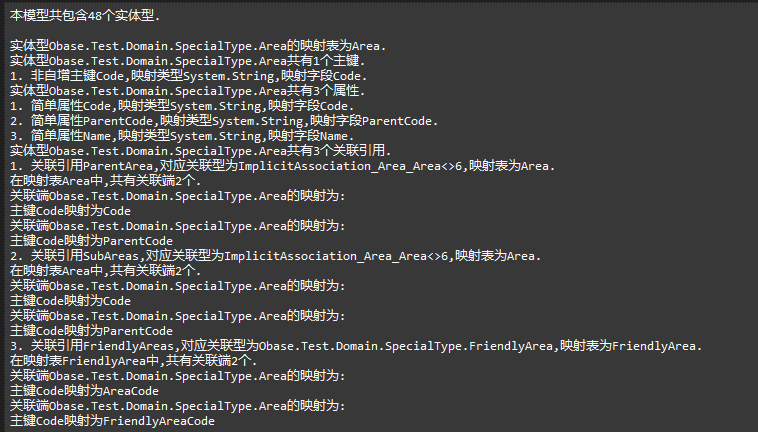

在6.3.3中,Obase增加了一个新的工具类ObjectDataModelViewer,提供了GetSimpleObjectDataModelMappingView和GetFullObjectDataModelMappingView方法用于查看对象数据模型的映射关系.

其中GetSimpleObjectDataModelMappingView方法仅返回实体型本身和实体型上的关联引用的映射关系,GetFullObjectDataModelMappingView则额外包含了属性的映射关系.
方法返回StringBuilder,可以自行处理.

使用方法如下:

## .net版


```
var full = ObjectDataModelViewer.GetFullObjectDataModelMappingView(context);
```

## java版


Java版待重写

## 返回结果
典型的返回结果节选如下:

